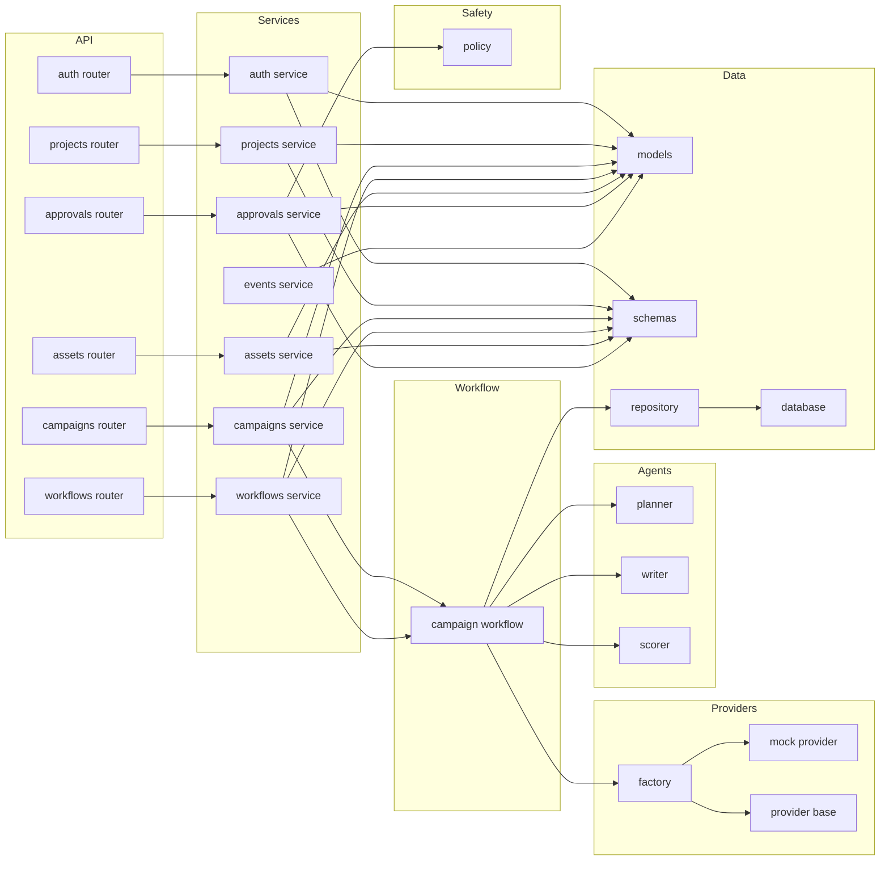

# Graph Blueprint — MoneyPrinterX Advanced

This file defines the **graph model expectations** GitNexus should infer when indexing the MoneyPrinterX Advanced scaffold.

## Layered dependency blueprint



## Process hypotheses

### Process: campaign execution
- campaign router receives request
- campaigns service validates and persists state
- workflows service starts run
- campaign workflow invokes planner
- campaign workflow invokes writer
- campaign workflow invokes scorer
- compliance policy evaluates publishability
- approvals service records approval state
- events service emits lifecycle events

### Process: approval gate
- router or workflow requests approval
- approvals service creates approval object
- compliance policy checks risk
- workflow branches on approval result
- events service records approval event

### Process: provider resolution
- workflow requests provider
- provider factory selects active implementation
- agent or workflow calls provider interface
- result returns into schema / model boundary

## Best GitNexus queries

```text
query({ query: "campaign workflow planner writer scorer approval provider" })
```

```text
context({ name: "create_campaign" })
```

```text
impact({ target: "policy", direction: "upstream" })
```

```text
impact({ target: "factory", direction: "downstream" })
```

```text
query({ query: "event emission workflow run status" })
```

## What a strong graph result looks like

A strong result should reveal:

- the API layer as entry points
- services as coordination hubs
- workflow as the densest orchestration region
- compliance as a cross-cutting concern
- providers as late-bound dependencies
- models / schemas / repository as the persistence backbone
